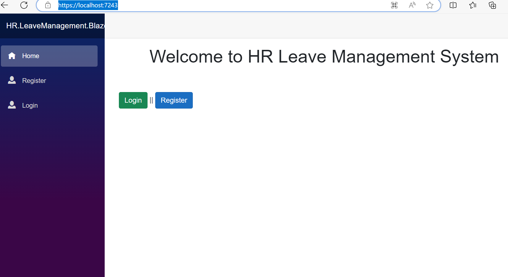
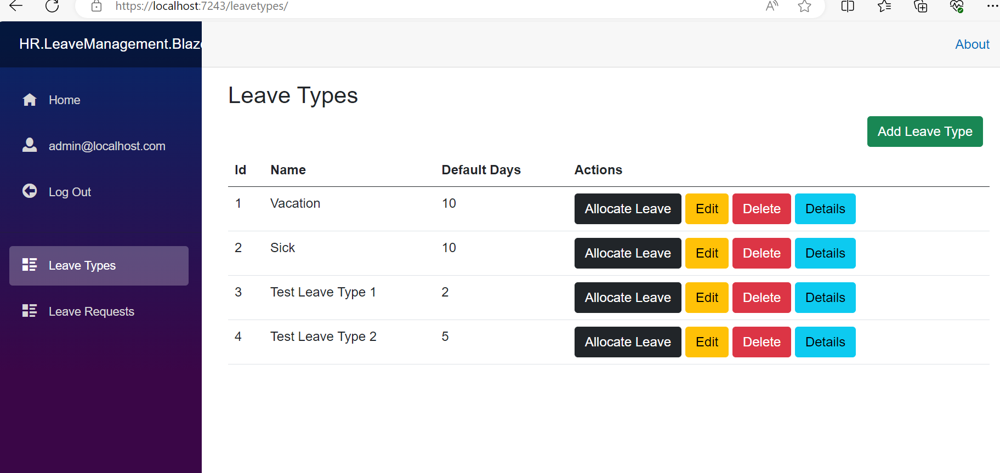
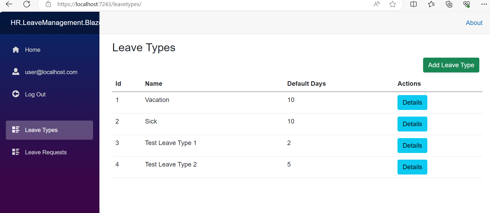
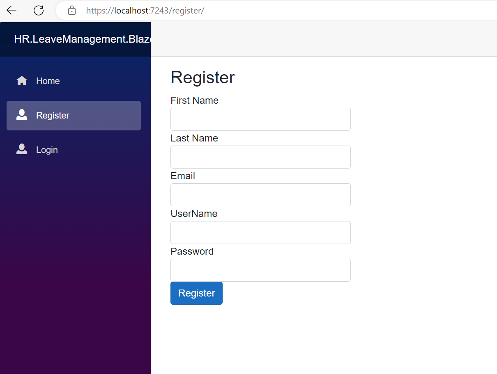

# .NET Core Clean Architecture

Leave Management system project applying clean architecture , using :
-  **Blazor WASM as front-end** 
- **.NET Core as back-end**
- **SQLITE for data persistency**

 ## Clean Architecture
- *Application and infrastructure layers.*
- *Unit and integration testing.*
- *API Development (Response Logging, JWT Security, Swagger Documentation)*
- *Blazor UI Development (Consume API, NSwagStudio, Custom Handlers and Auth Provider)*

## Coding Patterns and Concepts
- *Dependency Injection*
- *Separaion of Concerns*
- *CQRS and Mediator Patterns*
- *Repository Pattern*

## Screenshots

### Home 

### Admin View 

### Simple User View 

### Register View 

